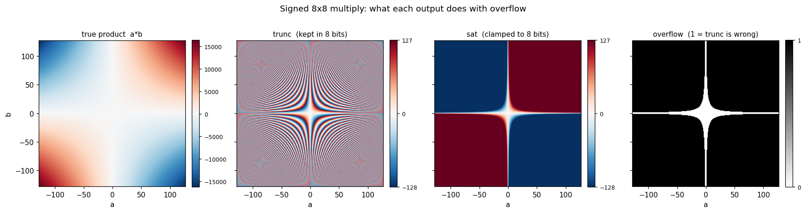

# What Happens to a Product That Does Not Fit

Multiply two 8-bit numbers and the answer needs 16 bits.  That is not a corner
case — it is always true.  So when a design multiplies two 8-bit values and
stores the result in 8 bits, something is thrown away every time, and the whole
question is *what*.

`int_prod.sv` computes one product and reports it four different ways at once,
so the four answers can be compared side by side.

## The module

~~~systemverilog
module int_prod #(
    parameter int W = 8
) (
    input  logic signed [W-1:0]   a,
    input  logic signed [W-1:0]   b,
    output logic signed [2*W-1:0] prod,        // full product — nothing lost
    output logic        [W-1:0]   hi,          // upper half, as bits
    output logic        [W-1:0]   lo,          // lower half, as bits
    output logic signed [W-1:0]   trunc,       // what "a*b" gives you in W bits
    output logic signed [W-1:0]   sat,         // clamped instead of wrapped
    output logic                  overflow,    // did trunc lose the value?
    output logic                  hi_nonzero   // the WRONG test — see -1 * 1
);
~~~

Note there is no `clk` and no `rst`.  This is pure combinational logic: outputs
follow inputs after a propagation delay and nothing is remembered.  It is also
perfectly synthesizable — this would become real gates on a device.

## The same expression, twice, with different answers

These two lines are the heart of the demo:

~~~systemverilog
    prod  = a * b;          // LHS is 2W bits -> operands widen -> exact
    trunc = a * b;          // LHS is  W bits -> the multiply happens in W bits -> wraps
~~~

Identical text. Different results.

SystemVerilog sizes an arithmetic expression to fit **its destination**, not
just its operands.  Because `prod` is 16 bits wide, `a` and `b` are widened to
16 bits first and the multiply is exact.  Because `trunc` is 8 bits wide, the
whole multiply is carried out in 8 bits and anything above bit 7 is simply
discarded.

This rule is one of the most common sources of surprise in SystemVerilog.  It is
worth reading those two lines until they stop looking like a typo.

## Truncation, or saturation

Discarding the top half is not the only option.  Saturation clamps the value to
the largest magnitude that *does* fit:

~~~systemverilog
    if (prod > SAT_MAX)
        sat = SAT_MAX;
    else if (prod < SAT_MIN)
        sat = SAT_MIN;
    else
        sat = prod;         // it fits, so this truncation loses nothing
~~~

That last branch is worth a moment.  It truncates too — `prod` is 16 bits and
`sat` is 8 — but only after the `if` has established that the value fits.
Truncation is safe exactly when you have already proved it is unnecessary.

## Reading a part-select

~~~systemverilog
    hi = prod[2*W-1:W];
    lo = prod[W-1:0];
~~~

A part-select in SystemVerilog is **always unsigned**, whatever the thing you
sliced was declared as.  `hi` and `lo` are views of the bits of `prod`, not
numbers in their own right, and they are declared `logic [W-1:0]` — without
`signed` — to say so.  This comes back in [`samp_pack`](./samp_pack.md), where
it causes a real bug.

## Detecting overflow, and getting it wrong

The honest test asks the obvious question — is the 8-bit answer the true answer?

~~~systemverilog
    overflow = (prod != trunc);
~~~

Both are signed, so `trunc` sign-extends to 16 bits before the comparison and
this means exactly what it says.

The test most people write first is different:

~~~systemverilog
    hi_nonzero = |hi;   // reduction OR — is any bit of the top half set?
~~~

For **unsigned** values that is correct.  For signed values it is not, and the
reason is that a negative number has ones in its upper bits.  Try `a = -1`,
`b = 1`: the product is `16'hFFFF`, so `hi` is `8'hFF` and `hi_nonzero` is 1 —
yet `trunc` is `-1`, which is exactly right.  The test cries wolf on every
negative product.

## What the testbench prints

`tb_int_prod.sv` reads its vectors from a file, drives the module with each one,
and writes every output back out for the Python side to check.  The first six
rows are the ones worth staring at:

~~~
  a     b  |            prod       hi       lo |  trunc    sat  ovf  hi!=0
-----------+----------------------------------+---------------------------
   3     5  | 0000000000001111 00000000 00001111 |     15     15    0     0
 100   100  | 0010011100010000 00100111 00010000 |     16    127    1     1
-100   100  | 1101100011110000 11011000 11110000 |    -16   -128    1     1
  16    16  | 0000000100000000 00000001 00000000 |      0    127    1     1
  20    20  | 0000000110010000 00000001 10010000 |   -112    127    1     1
  -1     1  | 1111111111111111 11111111 11111111 |     -1     -1    0     1
~~~

Row by row:

| `a` | `b` | true `a*b` | `trunc` | what it shows |
|---|---|---|---|---|
| 3 | 5 | 15 | 15 | fits in 8 bits; everything agrees |
| 100 | 100 | 10000 | **16** | a plausible-looking, completely wrong answer |
| -100 | 100 | -10000 | -16 | the same on the negative side; `sat` gives -128 |
| 16 | 16 | 256 | **0** | two nonzero inputs multiply to zero |
| 20 | 20 | 400 | **-112** | two positive inputs multiply to a negative |
| -1 | 1 | -1 | -1 | no overflow at all — but `hi_nonzero` says there is |

The values are printed in binary as well as decimal on purpose.  In decimal,
`400` becoming `-112` looks like a malfunction.  In binary you can see that
nothing malfunctioned: `0000000110010000` simply had its top eight bits removed,
leaving `10010000`, and the leading 1 of what remains is now a sign bit.

## The whole input space at once

There are only 65,536 possible inputs, so the demo evaluates every one of them:

The true product is smooth.  `trunc` is chaos — the bands are the value wrapping
round and round as the product grows, and neighbouring inputs land in completely
different places.  `sat` keeps the sign and the general shape, and pays for it by
flattening to ±127/-128 across most of the plane: it is wrong about the
magnitude, but never wrong about which way the answer points.

The last panel is the overflow mask.  The white region — where 8 bits are
genuinely enough — is a thin hyperbola around the axes.  Everything black is a
wrong answer waiting to happen.

## Checking against Python

The build compares the SystemVerilog output against the Python golden model for
every one of those 65,542 rows (the six teaching vectors, then the full grid):

~~~bash
    python datatypes_build.py --through int_prod_check
~~~

If any row disagrees, the check stops the build and reports the first
difference.  If none does, the two implementations are equivalent — not "seem to
work", but equivalent, over the entire input space.

---

Go to [packing a data structure](./samp_pack.md).
