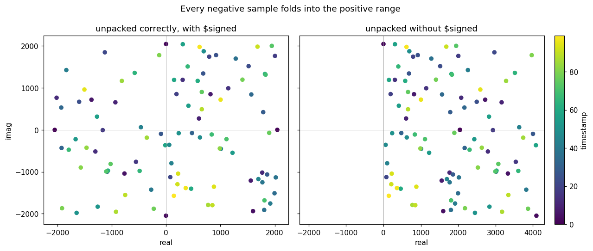

# Packing a Sample Into a Word

Hardware moves data over buses of a fixed width, so a structure with several
fields has to be squeezed into a word and pulled apart again at the other end.
This part of the demo does that for a timestamped complex sample:

| field | width | type |
|---|---|---|
| `time` | 8 | unsigned |
| `real` | 12 | signed |
| `imag` | 12 | signed |
| | **32** | = exactly one word |

Eight plus twelve plus twelve is thirty-two, which is not a coincidence.  This
is roughly how a stream of samples from an ADC or a radio front end is carried
over a 32-bit bus, and you will meet the same layout again when we get to
streaming interfaces.

The layout, most significant bit first:

~~~
bit  31..24 : time   (8b unsigned)
bit  23..12 : real  (12b signed)
bit  11..0  : imag  (12b signed)
~~~

## Packing

~~~systemverilog
    word = {t_in, re_in, im_in};
~~~

That is the whole of it — a **concatenation**, written with braces, laying the
three fields end to end.

It costs something, though, and the cost is easy to miss: a concatenation result
is **always unsigned**, whatever the pieces were declared as.  `re_in` was
`logic signed [11:0]`, but once it is inside `word` that fact is gone.  Nothing
in the bits records it.  Signedness is not a property the data carries around; it
is a decision about how to read it, and packing throws the decision away.

Which means unpacking has to make the decision again.

## Unpacking, and the bug that is waiting there

~~~systemverilog
    t_out  = word[31:24];
    re_out = $signed(word[23:12]);   // sign-extends -> correct
    im_out = $signed(word[11:0]);

    re_bad =         word[23:12];    // zero-extends -> wrong
~~~

`re_out` and `re_bad` slice exactly the same twelve bits.  They differ only by
`$signed`, and they disagree on every negative sample.

The reason is the rule from [`int_prod`](./int_prod.md): a part-select is always
unsigned.  Those twelve bits are just bits.  Widening them into a 16-bit
destination has to fill the top four bits with *something*, and unless you say
otherwise the answer is zero — so `0xC18`, which is `-1000` as a 12-bit signed
value, arrives as `+3096`.

Note that this only shows up because the destination is wider than the field.
Unpacking a 12-bit field into a 12-bit variable would appear to work: the same
bits, read the right way, by luck.  Real code unpacks into a working register
that is wider, and that is where it bites.

## What it looks like

The demo packs 100 samples, unpacks them both ways, and plots them on the
complex plane with the timestamp as colour:

On the left, samples fill all four quadrants, as they should.  On the right, the
left half of the plane is **empty** — every sample that had a negative real part
has been folded up into the range 2048–4095, on top of the samples that were
legitimately positive.  The data is not merely wrong, it is unrecoverably mixed
together.

## Two things get checked

`tb_samp_pack.sv` reads the samples, packs and unpacks each one, and the build
checks two separate claims:

1. **Cross-language.** The 32-bit word SystemVerilog built is bit-for-bit the
   word Python built.
2. **Round trip.** `unpack(pack(x)) == x`, for every sample.

The second one is a different kind of check from anything in `int_prod`.  It is
a **property** — a statement that must hold for all inputs — rather than a
comparison against a stored list of expected answers.  Properties are often
easier to be confident in than golden values, because you do not have to trust
that the golden values were right in the first place.

The vectors deliberately include the awkward cases: the most negative value
(`-2048`), the most positive (`2047`), zero, and `-1`.  The first rows the
testbench prints are exactly those:

~~~
   t     re     im |     word (hex) | t_out  re_out  im_out |  re_bad
-------------------+----------------+-----------------------+---------
   0  -2048     -1 |       00800fff |     0   -2048      -1 |    2048
   1   2047      0 |       017ff000 |     1    2047       0 |    2047
   2      0   2047 |       020007ff |     2       0    2047 |       0
   3     -1  -2048 |       03fff800 |     3      -1   -2048 |    4095
   4   1600  -1939 |       0464086d |     4    1600   -1939 |    1600
   5   -765  -1042 |       05d03bee |     5    -765   -1042 |    3331
~~~

`re_out` is right in every row.  `re_bad` matches it on the positive samples and
is wrong on every negative one: `-2048` becomes `2048`, `-1` becomes `4095`,
`-765` becomes `3331`.

## Python and SystemVerilog have opposite defaults

The same packing in Python looks like this:

~~~python
    word = ((t & 0xFF) << 24) | ((re & 0xFFF) << 12) | (im & 0xFFF)
~~~

The masks are not decoration.  Python integers are unbounded, and a negative
value has infinitely many leading one bits — so without `& 0xFFF` a negative
real part would run straight over the timestamp above it.

SystemVerilog needs no masks here at all, because the field widths are declared
and the language does the truncation for you.

That is the general shape of the difference between the two, and it is worth
carrying forward:

* **Python** keeps every bit unless you explicitly remove them.
* **SystemVerilog** removes every bit that does not fit, without telling you.

Neither default is wrong.  But they are opposites, and when a Python model and
an RTL implementation disagree, this is very often why.
