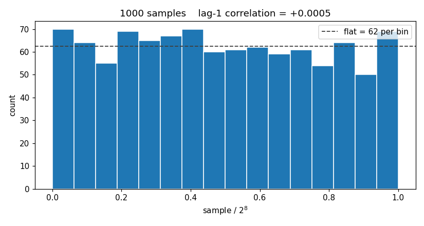

# Stage 2: evaluating before you build

```bash
python prng_build.py --through pyeval
```

You have a stream of numbers. Are they random?

You cannot answer that by reading the code — the code always looks right, which
is why you wrote it that way. You cannot answer it from a waveform either; a
waveform shows you one screenful of bits and every LFSR looks like noise at that
zoom. You answer it by **measuring the stream**, in Python, where measuring is a
line of NumPy.

And you do it *before* you write any SystemVerilog.

## Why this stage exists

The order most people reach for is: write the Python, write the hardware, then
check the hardware against the Python. That order has a hole in it. It tells you
whether your two implementations agree. It never tells you whether the thing they
agree on is any good.

Suppose your generator only advances one step per sample instead of eight.
Consecutive samples then share all but one of their bits. Your Python does it,
your SystemVerilog does it, the two match perfectly, and the cross-check goes
green. You have carefully built the wrong thing in two languages.

The measurement catches it in about a second, and it catches it while the design
is still Python:

| Steps per sample | Lag-1 correlation |
| --- | --- |
| 1 | ≈ 0.50 |
| 2 | ≈ 0.26 |
| 8 — correct | ≈ 0.00 |

A fix at this point costs you an edit. The same flaw found after you have written
the testbench, debugged the simulation and read the waveforms costs you an
afternoon. Found after synthesis and place-and-route, it costs a day. Found after
tapeout it costs rather more than that.

{: .important }
> A golden model is not just something to compare your hardware against. It is
> where you find out whether the design is worth building at all. That is the
> habit worth taking from this lab, and it is worth more than the LFSR.

## What you write

Three functions in `prng_eval.py`. The library calls are one line each — the work
is knowing *what* to compute and reading the documentation for the call that does
it.

### `histogram(samples, nbins, nvalues)`

How often does each value happen? Split the range `0 .. nvalues` into `nbins`
equal bins and count how many samples land in each. Return the counts, which must
sum to `len(samples)`.

Use **`np.histogram`**. Read its documentation carefully — in particular what it
returns, and what its `range` argument defaults to.

### `lag1_correlation(samples)`

Does each sample tell you anything about the next?

Pair every sample with its successor, giving the `n-1` pairs
(x<sub>0</sub>, x<sub>1</sub>), (x<sub>1</sub>, x<sub>2</sub>), … and take the
**Pearson correlation coefficient** of that set of pairs. Writing *a* for the
first element of each pair and *b* for the second:

```
                  sum of (a[i] - mean(a)) * (b[i] - mean(b))
   r  =  ----------------------------------------------------------
         sqrt( sum of (a[i] - mean(a))^2 * sum of (b[i] - mean(b))^2 )
```

The result lies between -1 and +1. Near 0 means each sample says nothing about
its successor; near ±1 means it says a great deal.

Use **`np.corrcoef`**. It does not return a single number, so read its
documentation for what it does return and take the part you need.

### `plot_evaluation(...)`

Draw the histogram and save it. Only the matplotlib backend is set up for you —
writing to a file rather than opening a window is what `Agg` is for.

**`plt.subplots()`** gives you a figure and an axis. On the axis, **`bar`** draws
the bars and **`axhline`** draws the flat line they are measured against. Label
both axes, and put the sample count and the correlation in the title so the
picture says what it is showing.

Plot the `counts` you were passed rather than recomputing them from `samples`.
The picture is then a picture of *your* `histogram`, so a mistake in it is
something you can see rather than only something you are told.

Finish with `fig.savefig(out_path)`. **The figure goes into your submission**, and
the lab checks that you produced one — so a stage that draws nothing loses those
points even if both measurements are right.

## What it should look like

Scale the x-axis so it runs 0 to 1 rather than 0 to 255 — the samples then read
as fractions, which is how a uniform random number is usually wanted. Aim for
something like this:



Yours will not be identical, and it does not need to be. What matters is that the
bars are your counts, the flat line is there to compare them against, and the
title tells you the correlation.

## You need both

The sequence 0, 1, 2, … 255, 0, 1, … has a **perfectly** flat histogram. Every
value occurs exactly as often as every other. It is also completely predictable —
tell me one sample and I will tell you the rest of the sequence.

The histogram cannot tell that apart from a good generator. The correlation can,
instantly. *Uniform is not the same as random*, and one number will not do the
work of two.

This generalises well beyond PRNGs. Any single summary statistic can be satisfied
by something that is wrong in a direction the statistic does not look.

## Reading the picture

Your figure lands in `results/prng_hist.png` each time the stage runs.

A working generator gives bars that scatter visibly around the flat line. Real
randomness is *lumpy*: with 1000 samples in 16 bins you should expect the worst
bin to sit 20–30% away from flat, and bars that all landed at exactly 62 would be
evidence of something other than chance.

Look for:

- **A single towering bar** — your generator is stuck, or your bin range is wrong.
- **A staircase** — you have built a counter, not an LFSR. The correlation will
  be near 1.0 and will say so.
- **Everything in the left half** — your samples never reach the top of the
  range; suspect a mask or a part-select that is one bit short.
- **Bars that are suspiciously equal** — check that you are plotting the stream
  and not something derived from the bin index.

## What is graded

Two things per measurement, and they are separate: whether your measuring code
computes the right value, and whether the value it computes shows a good design.

A correct measurement of a bad generator earns the first and not the second. That
is the distinction this stage is about — and it is the situation you would rather
be in than the alternative, which is a bad generator you have no way of noticing.

The figure carries points of its own, but only for *existing*. Nothing inspects
what it looks like — the file simply goes into your submission, where it can be
read by a person. That is the honest division of labour: whether a plot is worth
looking at is a judgement a script cannot make, and the checks a script *could*
make are ones you could satisfy without drawing anything useful.

Run `python prng_build.py --grades` at any time to see where you stand and why.

----

Go to [the SystemVerilog](./sv.md)
